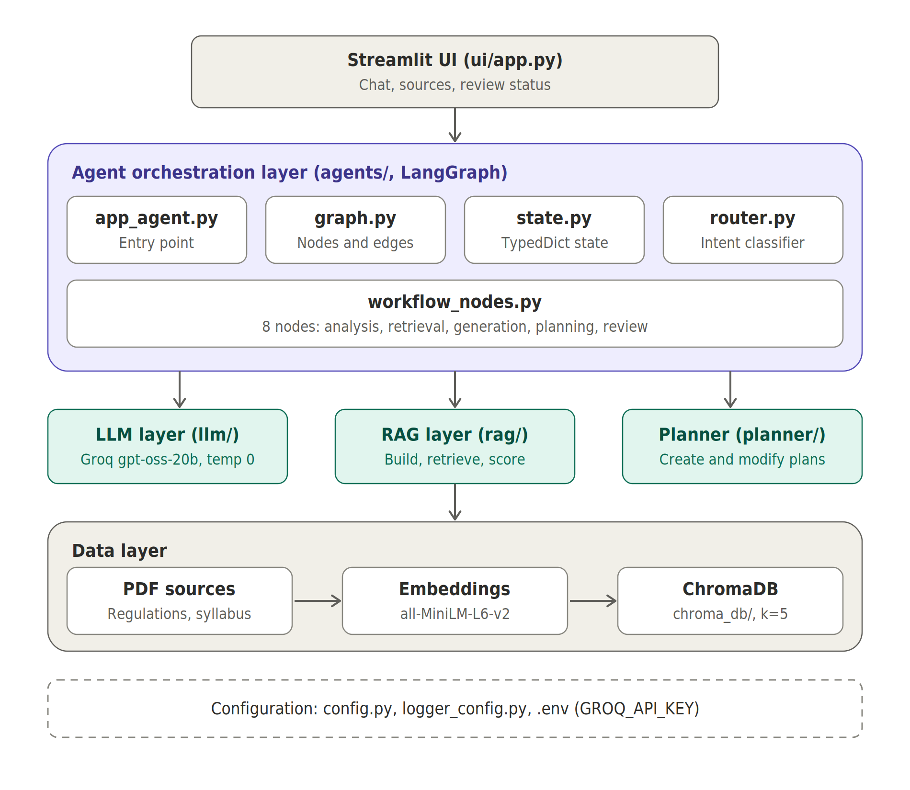
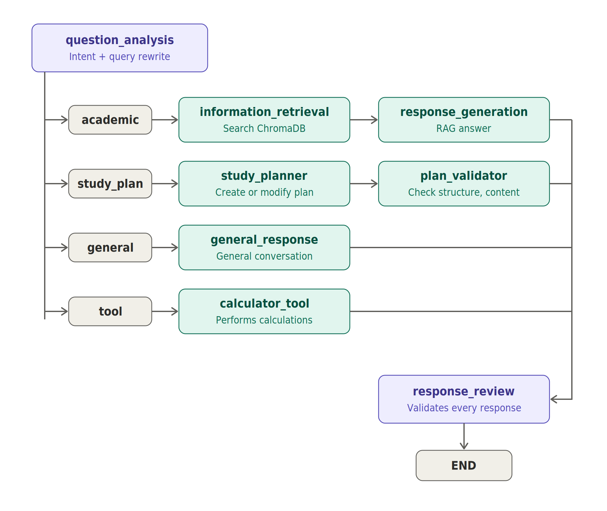

# AI College Academic Assistant

An intelligent academic assistant for college students that provides:
- Academic Q&A based on college regulations and syllabus documents
- Syllabus-aware study plan generation
- Study plan modification and customization

Built with LangGraph, Groq LLM, ChromaDB, and Streamlit.

## Features

- **Academic Q&A**: Ask questions about college regulations, syllabus, attendance, exams, credits, etc.
- **Study Planner**: Generate personalized study plans based on official syllabus documents
- **Plan Modification**: Adjust existing study plans (move topics, change duration, etc.)
- **Intent Classification**: Automatically routes queries to the appropriate agent (ACADEMIC, STUDY_PLAN, GENERAL, TOOL)
- **Calculator Tool**: Handles computational operations and calculations
- **Response Validation**: All responses are reviewed and validated before being returned

## Tech Stack

- **LLM**: Groq (openai/gpt-oss-20b)
- **Orchestration**: LangGraph
- **Vector Database**: ChromaDB
- **Embeddings**: HuggingFace (sentence-transformers/all-MiniLM-L6-v2)
- **UI**: Streamlit
- **RAG**: LangChain

## Architecture

### System overview


Shows the layers from the Streamlit UI through the LangGraph agent layer, the LLM/RAG/planner services and the ChromaDB data layer.

### LangGraph workflow


Shows how question_analysis routes each query (academic, study_plan, general, tool) through its nodes to response_review.

## Prerequisites

- Python 3.9+
- Groq API key ([Get one here](https://console.groq.com/))

## Installation

1. **Clone the repository**
   ```bash
   git clone <repository-url>
   cd AI-College-Academic-Assistant
   ```

2. **Create a virtual environment**
   ```bash
   python -m venv .venv
   .venv\Scripts\activate  # On Windows
   # or
   source .venv/bin/activate  # On Linux/Mac
   ```

3. **Install dependencies**
   ```bash
   pip install -r requirements.txt
   ```

4. **Set up environment variables**
   - Create a `.env` file in the project root
   - Add your Groq API key:
     ```
     GROQ_API_KEY=your_api_key_here
     ```
   - See `.env.example` for reference

5. **Prepare the vector database**
   - Place your PDF documents in the appropriate directories:
     - `data/academic_regulations/` - College regulations PDFs
     - `data/department_syllabus/` - Department syllabus PDFs
   - Run the vector store creation script:
     ```bash
     python rag/create_vectorstore.py
     ```
   - This will create a `chroma_db/` directory with the vector embeddings

## Troubleshooting

### Missing Environment Variables
**Error:** `ValueError: Missing required environment variables: GROQ_API_KEY`

**Solution:**
- Ensure you have created a `.env` file in the project root
- Add your Groq API key: `GROQ_API_KEY=your_api_key_here`
- Get a free API key from [https://console.groq.com/](https://console.groq.com/)

### Vector Database Not Found
**Error:** `ValueError: ChromaDB collection 'college_knowledge' does not exist`

**Solution:**
- Ensure you have run `python rag/create_vectorstore.py`
- Verify that PDF documents exist in `data/academic_regulations/` and `data/department_syllabus/`
- Check that the `chroma_db/` directory was created successfully

### Import Errors
**Error:** `ModuleNotFoundError: No module named 'config'`

**Solution:**
- Ensure you are running scripts from the project root directory
- Verify all dependencies are installed: `pip install -r requirements.txt`
- If running Streamlit, use: `streamlit run ui/app.py` from the project root

### Streamlit UI Issues
**Error:** Streamlit fails to start or shows connection errors

**Solution:**
- Check that the `.env` file is in the project root
- Verify the Groq API key is valid and has sufficient credits
- Try clearing the conversation and refreshing the page
- Check the terminal for detailed error messages

### Study Plan Generation Fails
**Error:** "I could not find the requested subject in the official department syllabus"

**Solution:**
- Ensure the subject name matches what's in your syllabus documents
- The system currently supports DBMS well; other subjects may need syllabus documents
- Check that the syllabus PDFs are in `data/department_syllabus/`
- Re-run `python rag/create_vectorstore.py` after adding new documents

## Usage

### Running the Streamlit UI

```bash
streamlit run ui/app.py
```

The UI will open in your browser at `http://localhost:8501`

### Example Queries

**Academic Questions:**
- "What is the minimum attendance requirement?"
- "How many credits are required for graduation?"
- "What are the internship rules?"

**Study Plan Requests:**
- "Create a 7-day study plan for DBMS with 2 hours per day"
- "Generate a 10-day study plan for Data Structures"

**Study Plan Modifications:**
- "Move the Day 5 topics to Day 6"
- "Add more time to Day 3"
- "Remove the topics from Day 2"

### Testing

Run the graph test:
```bash
python agents/test_graph.py
```

Run the plan flow test:
```bash
python agents/test_plan_flow.py
```

## Project Structure

```
AI-College-Academic-Assistant/
├── agents/
│   ├── academic_agent.py       # Handles academic Q&A
│   ├── app_agent.py            # Main agent entry point
│   ├── general_agent.py        # Handles general queries
│   ├── graph.py                # LangGraph workflow
│   ├── router.py               # Intent classifier
│   ├── state.py                # Agent state definition
│   ├── study_agent.py          # Handles study plan creation/modification
│   ├── workflow_nodes.py       # LangGraph workflow node implementations
│   ├── test_graph.py           # Graph integration tests
│   └── test_plan_flow.py       # Plan flow tests
├── data/
│   ├── academic_regulations/   # College regulation PDFs
│   └── department_syllabus/   # Syllabus PDFs
├── docs/
│   ├── architecture_overview.png      # System architecture diagram
│   └── langgraph_workflow.png         # LangGraph workflow diagram
├── llm/
│   ├── rag_chain.py            # RAG chain for academic queries
│   └── test_groq.py             # Groq LLM tests
├── planner/
│   ├── plan_modifier.py        # Study plan modification logic
│   ├── study_planner.py        # Study plan generation logic
│   └── test_planner_groq.py    # Planner tests
├── rag/
│   ├── create_vectorstore.py   # Vector store creation script
│   ├── load_documents.py       # Document loading utilities
│   ├── retriever.py            # ChromaDB retriever
│   └── test_retrieval.py       # Retrieval tests
├── ui/
│   └── app.py                  # Streamlit UI
├── config.py                   # Centralized configuration
├── logger_config.py            # Logging configuration
├── .env                        # Environment variables (not in git)
├── .env.example                # Environment variables template
├── .gitignore
├── requirements.txt
└── README.md
```

## How It Works

1. **Intent Classification**: The router classifies user queries into ACADEMIC, STUDY_PLAN, GENERAL, or TOOL
2. **Academic Queries**: The retrieval node fetches relevant documents from ChromaDB, then the RAG chain generates answers grounded in college documents
3. **Study Plan Requests**: The study planner retrieves syllabus context from the vector store and generates structured study plans; modifications use deterministic logic or LLM-based adjustments
4. **General Queries**: Handled by the general response node for conversational interactions
5. **Tool Requests**: Calculator node handles computational operations
6. **Response Review**: All responses pass through a review node for validation before being returned to the user

## Notes

- The `chroma_db/` directory is gitignored and must be created locally
- The `.env` file is gitignored for security
- Currently, the study planner supports DBMS syllabus (can be extended for other subjects)

## Future Enhancements

- Support for multiple subjects beyond DBMS in study planner
- User authentication and persistent study plans
- Progress tracking for study plans
- Export study plans to different formats (PDF, CSV, etc.)
- Integration with calendar applications
